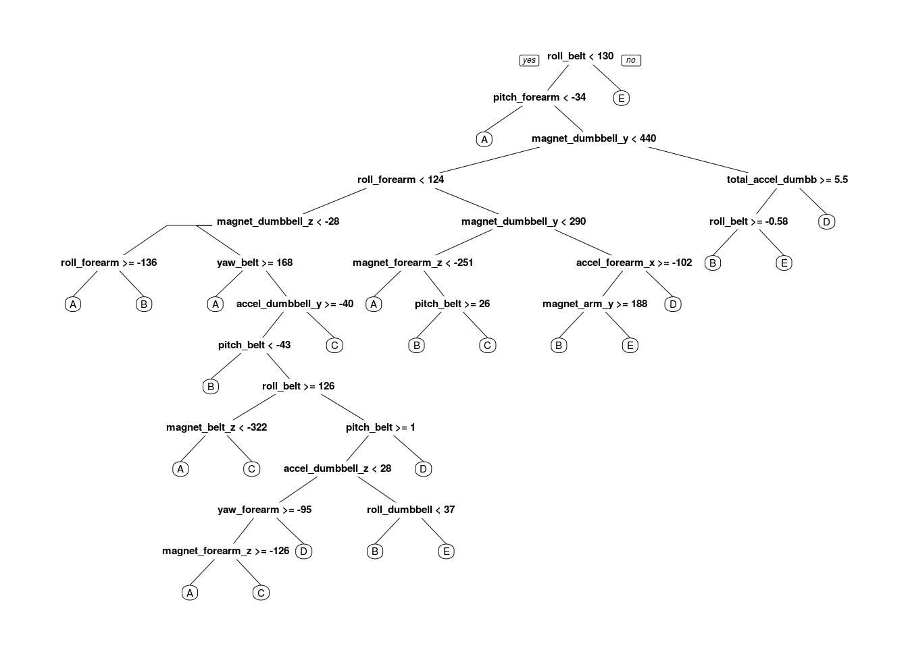
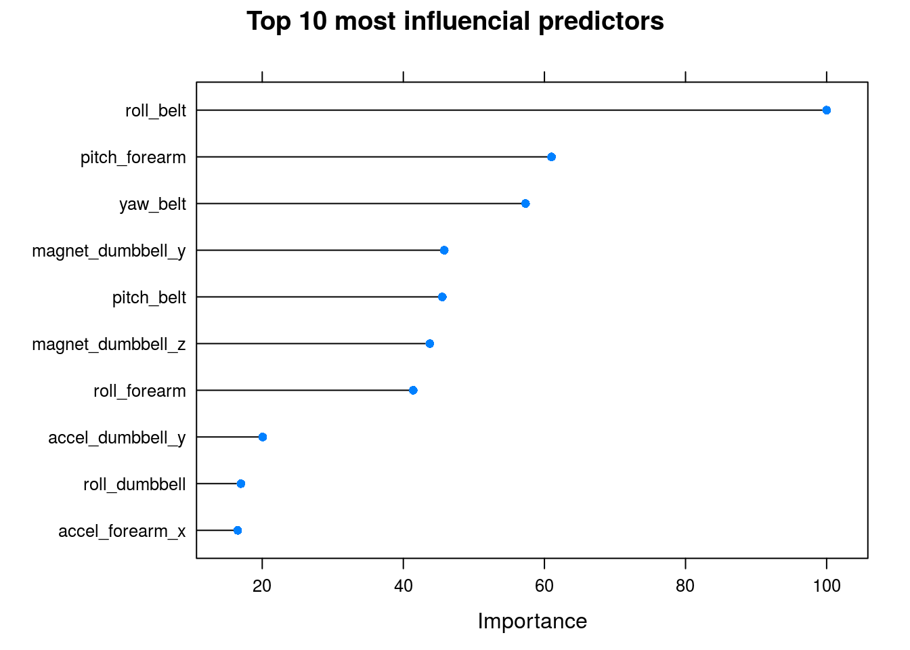
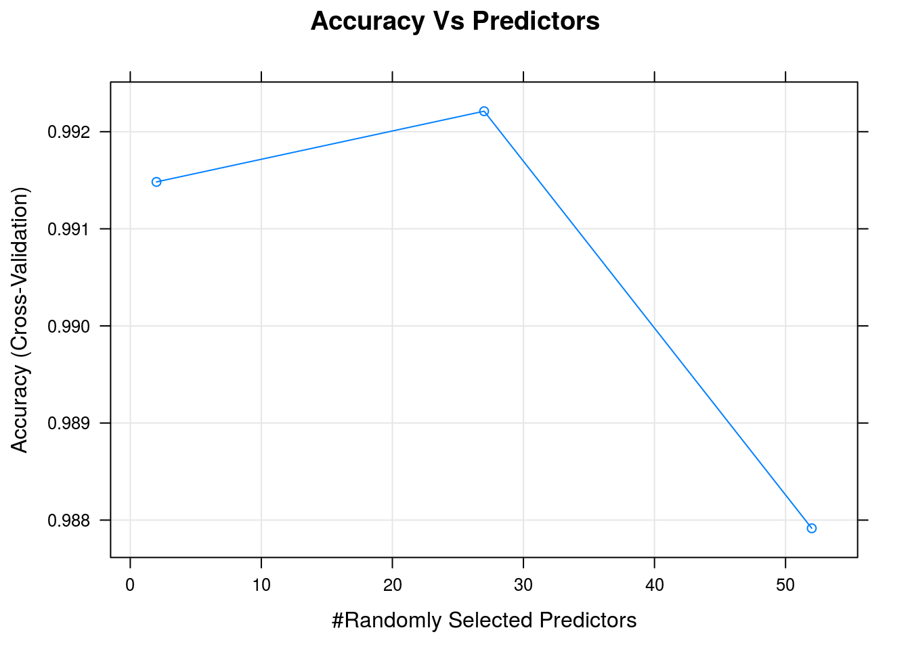
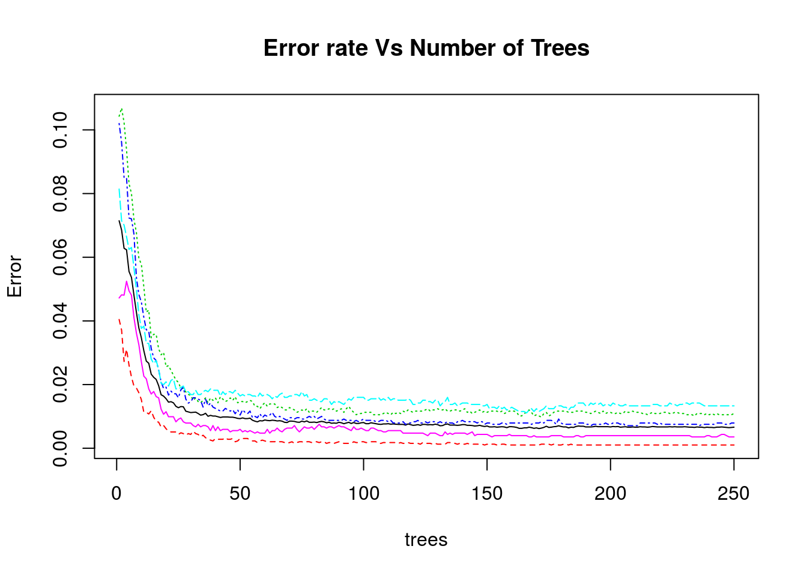

## Abstract
In this project for Practical Machine Learning, a random forest model is built to predict human activity based on the observations collected in the Groupware@LES Human Activity Recognition dataset.

The Human Activity Recognition dataset contains accelerometer data collected from sensors on the belt, forearm, arm, and dumbbell from 6 participants that were asked to perform barbell lifts correctly and incorrectly in 5 different ways (sitting-down, standing-up, standing, walking, and sitting).
The **goal** is to predict the manner in which they did the exercise.

A **random forest model** was built with 250 trees using 5-fold cross-validation and achieved an accuracy on the validation data of 99.47% with an sample error of 0.53%.

Moreover, built, trained and validated the learning algorithm, we were predicted 20 new cases in the test set 20 with 100% accuracy.

## Work Enviroment 

* Set Work Directory. 
* Load the packages that I will use later.

```r
setwd("/home/gianfranco/workspace/Practical_Machine_Learning/Project")

load <- function(package){
  new.package <- package[!(package %in% installed.packages()[, "Package"])]
  if (length(new.package))
    install.packages(new.package, dependencies = TRUE)
  sapply(package, require, character.only = TRUE)
} 

packages <- c("caret", "randomForest", "rpart", "rpart.plot")
load(packages)
```

```
## Loading required package: caret
## Loading required package: lattice
## Loading required package: ggplot2
## Loading required package: randomForest
## randomForest 4.6-10
## Type rfNews() to see new features/changes/bug fixes.
## Loading required package: rpart
## Loading required package: rpart.plot
```

```
##        caret randomForest        rpart   rpart.plot 
##         TRUE         TRUE         TRUE         TRUE
```
## Load the data  
* Load Training and Testing datasets from Human Activity Recognition (http://groupware.les.inf.puc-rio.br/har) 

```r
train_File <- "pml-training.csv"
test_File  <- "pml-testing.csv"

if (!file.exists(train_File)) {
  download.file("https://d396qusza40orc.cloudfront.net/predmachlearn/pml-training.csv", destfile=train_File, method="curl",quiet=TRUE)
}

if (!file.exists(test_File)) {
  download.file("https://d396qusza40orc.cloudfront.net/predmachlearn/pml-testing.csv", destfile=test_File, method="curl",quiet=TRUE)
}

training <- read.csv(train_File)
testing <- read.csv(test_File)
```

## Explore datasets

```r
dim(training)
```

```
## [1] 19622   160
```

```r
dim(testing)
```

```
## [1]  20 160
```
The *Training Set* contains **19622 observations** and **160 variables** and the *Test Set* contains **20 observations** and **160 variables**.

It is a *Classification Problem*, therefore, the response variable is called **class** and consists of 5 factors, labeled A-E, representing the physical activities: *sitting-down, standing-up, standing, walking, and sitting*.

A summary gives us information on how the class response is distributed in the Training Set:

```r
summary(training$classe)
```

```
##    A    B    C    D    E 
## 5580 3797 3422 3216 3607
```
It is evident that in the training set there is no class skew

## Preprocess Data
* I need to drop columns with NAs, drop highly correlated variables and drop variables with 0 (or approx to 0) variance.

**Remove varables with NA’s**

The Training Set contains a lot of missing values, so we remove variables with NA’s:

```r
sum(complete.cases(training))
```

```
## [1] 406
```

```r
trainingCleaned <- training[, colSums(is.na(training)) == 0]
dim(trainingCleaned)
```

```
## [1] 19622    93
```

**Remove variables with near zero variance**

Variables with unique values e.g zero or near zero variance are removed as they have little or no impact on the response.

```r
nzv <- nearZeroVar(trainingCleaned, saveMetrics=TRUE)
trainingCleaned <- trainingCleaned[, nzv[,"nzv"] == FALSE]
dim(trainingCleaned)
```

```
## [1] 19622    59
```

**Remove low-informations columns**

Remove the variables that do not contain useful information for learning, such as timestamp, user_name, new_window etc.

```r
trainingCleaned <- trainingCleaned[, -grep("timestamp|user_name|new_window|num_window|X", names(trainingCleaned))]
dim(trainingCleaned)
```

```
## [1] 19622    53
```
The Cleaned Training Set now contains **19622 observations** and **53 variables**.

## Model
* A predictive model is fitted using Random Forest algorithm. with **5-fold cross validation** for a good bias-variance trade-off.
* I need to split the cleaned Training Set in two samples. **70%** for Training Set and **30%** for Cross Validation Set.

```r
set.seed(1234)
inTrain <- createDataPartition(trainingCleaned$classe, p=0.7, list=FALSE)
training <- trainingCleaned[inTrain,]
validation <- trainingCleaned[-inTrain, ]

timestamp(stamp = date(),
           prefix = "##------Start: ", suffix = " ------##",
           quiet = FALSE)
```

```
## ##------Start: Sun Sep 27 20:34:17 2015 ------##
```

```r
model <- train(classe ~ .,
                  data=training, method="rf",
                  trControl=trainControl(method="cv", number=5),
                  prox=TRUE,
                  ntree=250)

timestamp(stamp = date(),
           prefix = "##------ End: ", suffix = " ------##",
           quiet = FALSE)
```

```
## ##------ End: Sun Sep 27 23:24:43 2015 ------##
```

```r
model
```

```
## Random Forest 
## 
## 13737 samples
##    52 predictors
##     5 classes: 'A', 'B', 'C', 'D', 'E' 
## 
## No pre-processing
## Resampling: Cross-Validated (5 fold) 
## Summary of sample sizes: 10990, 10988, 10991, 10990, 10989 
## Resampling results across tuning parameters:
## 
##   mtry  Accuracy   Kappa      Accuracy SD  Kappa SD   
##    2    0.9914828  0.9892255  0.001659687  0.002099744
##   27    0.9922110  0.9901471  0.001577078  0.001994300
##   52    0.9879158  0.9847138  0.003680413  0.004654061
## 
## Accuracy was used to select the optimal model using  the largest value.
## The final value used for the model was mtry = 27.
```

## Accuracy and Error of the model
* The performance of the model is estimated on the Validation Set.  

```r
predict <- predict(model, validation)
confusionMatrix(validation$classe, predict)
```

```
## Confusion Matrix and Statistics
## 
##           Reference
## Prediction    A    B    C    D    E
##          A 1674    0    0    0    0
##          B   10 1128    1    0    0
##          C    0    4 1018    4    0
##          D    0    1    6  956    1
##          E    0    0    2    4 1076
## 
## Overall Statistics
##                                           
##                Accuracy : 0.9944          
##                  95% CI : (0.9921, 0.9961)
##     No Information Rate : 0.2862          
##     P-Value [Acc > NIR] : < 2.2e-16       
##                                           
##                   Kappa : 0.9929          
##  Mcnemar's Test P-Value : NA              
## 
## Statistics by Class:
## 
##                      Class: A Class: B Class: C Class: D Class: E
## Sensitivity            0.9941   0.9956   0.9912   0.9917   0.9991
## Specificity            1.0000   0.9977   0.9984   0.9984   0.9988
## Pos Pred Value         1.0000   0.9903   0.9922   0.9917   0.9945
## Neg Pred Value         0.9976   0.9989   0.9981   0.9984   0.9998
## Prevalence             0.2862   0.1925   0.1745   0.1638   0.1830
## Detection Rate         0.2845   0.1917   0.1730   0.1624   0.1828
## Detection Prevalence   0.2845   0.1935   0.1743   0.1638   0.1839
## Balanced Accuracy      0.9970   0.9966   0.9948   0.9950   0.9989
```

```r
accuracy <- postResample(predict, validation$classe)
accuracy
```

```
##  Accuracy     Kappa 
## 0.9943925 0.9929059
```
The out sample error should be low as the random forest algorithm performs cross-validation internally.

```r
err <- sum(predict != validation$classe) * 100 / nrow(validation)
```
* The estimated accuracy of the model is **99.44%** and the estimated out sample error is **0.56%**

## Predictions on the Testing Set
* The model is applied to the original Testing Set.

```r
testData <- testing[, names(testing) %in% names(trainingCleaned)]
result <- predict(model, newdata=testData)
result
```
The selected model (Random Forest) was able to predict **100%** of the **20 cases** provided in the testing dataset.

## Tree and Graphs

```r
modelTree <- rpart(classe ~ ., data=trainingCleaned, method="class")
prp(modelTree) 
```




```r
top <- varImp(model)
plot(top, main = "Top 10 most influencial predictors", top = 10)
```




```r
plot(model, main="Accuracy Vs Predictors")
```




```r
plot(model$finalModel, main="Error rate Vs Number of Trees")
```



## Submission of Results
Apply machine learning algorithm for the prediction of the 20 test cases, and create the necessary files for the submission.

```r
featureset <- colnames(trainingCleaned)

pml_write_files = function(x){
  n = length(x)
  for(i in 1:n){
    filename = paste0("problem_id_",i,".txt")
    write.table(x[i],file=filename,quote=FALSE,row.names=FALSE,col.names=FALSE)
  }
}

testing_data <- testing[featureset[featureset!='classe']]
answers <- predict(model, newdata=testing_data)
answers
```

```
##  [1] B A B A A E D B A A B C B A E E A B B B
## Levels: A B C D E
```

```r
pml_write_files(answers)
```
